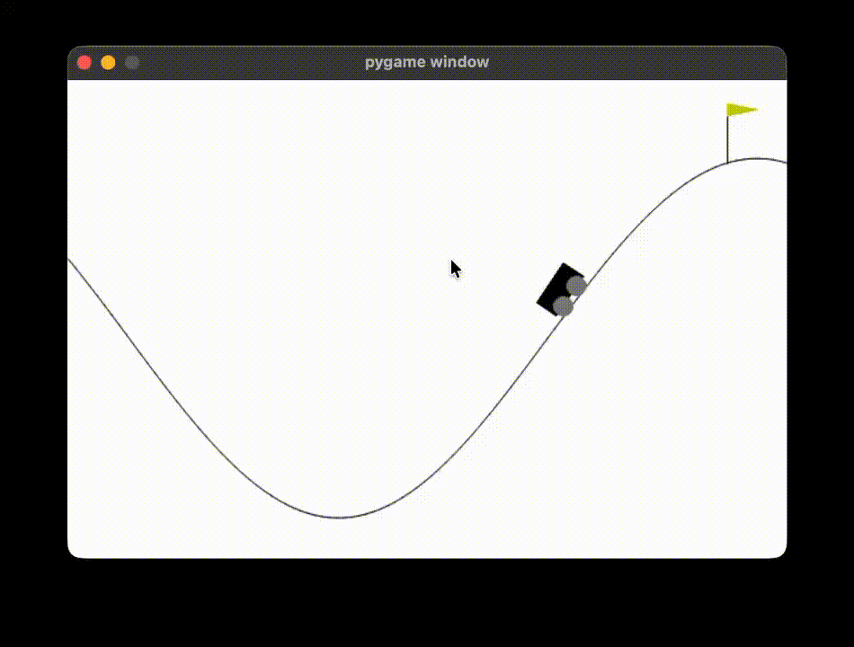

# Dreamer from Scratch

A from-scratch implementation of the Dreamer v1 architecture (Hafner et al., 2019) built using PyTorch.

### Motivation
Having previously implemented Ha & Schmidhuber's World Models, Dreamer felt like the natural next step, as it is a more powerful evolution of the same idea. Where World Models relied on a simple MDN-RNN for dynamics and a separate controller, Dreamer unifies everything under a single latent world model trained end-to-end. 

It learns behaviours entirely within the latent space by backpropagating through time, rather than relying on CMA or other black-box optimizers.

### Repository Structure
[dreamer-v1-from-scratch.ipynb](dreamer-v1-from-scratch.ipynb) contains the block-wise implementation of Dreamer v1, alongside the personal notes I took while replicating this architecture.

### Training
The world model is trained via latent imagination on [Mountain Car](https://gymnasium.farama.org/environments/classic_control/mountain_car_continuous/) using Gymnasium's continuous variant, where the agent must learn to build momentum to reach the goal.

### Results
The agent successfully learned to solve the Mountain Car task, converging on the momentum-building strategy.